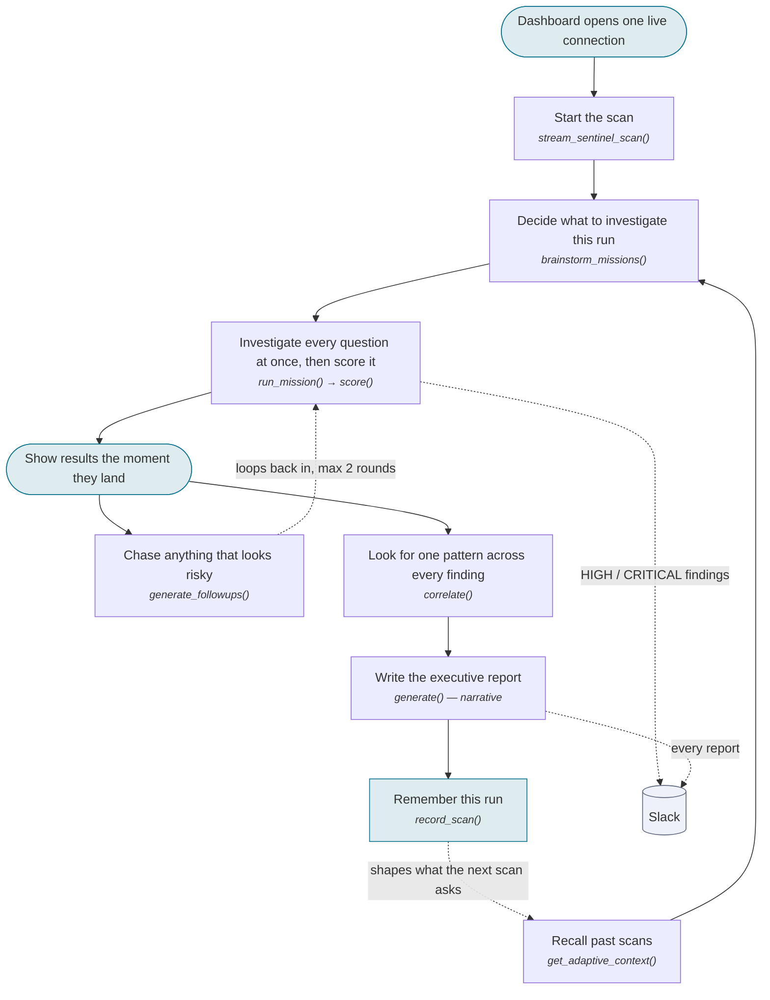
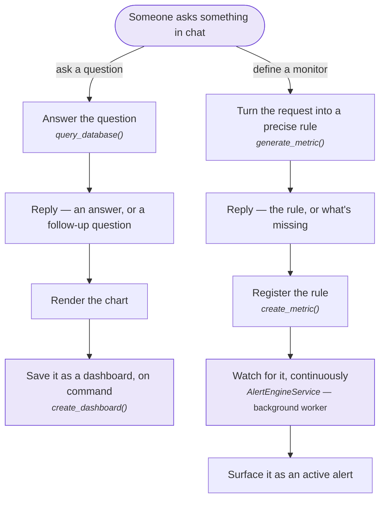

# 🦅 InsightOS: The Virtual CIO for Real-Time Financial Intelligence

[]()
[]()
[]()

> **InsightOS** transforms complex natural language into actionable executive-level business intelligence. It’s not just an NL2SQL tool; it’s an AI-driven decision engine that reasons across your entire database to provide strategic recommendations.

---

## 🏗️ System Architecture

InsightOS is really two products sharing one brain. Both answer questions the same way —
understand it, write SQL, check it, run it, chart it — but they call that machinery in opposite
directions: **Sentinel** calls it dozens of times a minute on questions it invents for itself;
the **Query** feature calls it once, on a question a person just typed.

### Primary architecture — the Sentinel scan (autonomous)

The dashboard opens one live connection and never asks again. Everything else — deciding what to
investigate, scoring how dangerous the answers are, deciding whether to dig deeper, and writing an
executive summary — happens on its own on the server and streams back down that same connection,
step by step, as it happens.



1. **One connection for the whole scan.** The dashboard opens a single live connection and never
   has to ask again. Every stage — deciding what to investigate, running dozens of checks, chasing
   risky ones deeper, comparing findings, writing the final report — plays out over that one
   connection and appears the instant it happens, instead of all at once at the end.
2. **What to investigate changes every run.** `brainstorm_missions()` asks an AI to write this
   run's audit questions across four areas — security, compliance, risk, operations — but first
   looks back at the last five runs: areas that kept turning out risky get more attention this
   time, anything that was **CRITICAL** last run gets a deeper follow-up, and exact questions asked
   recently are avoided so the scan doesn't repeat itself.
3. **Every question is fully investigated, all at the same time.** Each audit question is a
   plain-English ask. `run_mission()` answers it with the same understand-it → write-SQL →
   check-it → run-it → chart-it sequence a person typing a question would trigger — and every
   question in the batch runs at once rather than one after another, so a dozen checks finish
   about as fast as one.
4. **Risk is measured, not guessed.** Instead of trusting the AI's own sense of how alarming
   something sounds, `score()` works out a 0–100 number from what the data actually shows: how
   many people are affected, how much money is involved, how fast it's happening, whether flagged
   accounts are involved, and how severe the original question was meant to be.
5. **Nothing waits for the slowest question.** Every question's log and result are pushed out the
   moment they're ready, each one clearly tagged so results from different questions never get
   mixed up. The dashboard fills in card by card as the scan runs.
6. **Anything risky gets a second, sharper look.** A question that comes back with real risk (a
   score of 40 or higher) is handed to `generate_followups()`, which writes up to two new, more
   specific questions aimed at the exact people, accounts, or amounts just found. Those follow-ups
   get investigated the same way as any other question, and can chain up to two rounds deep.
7. **Separate findings get checked for a shared cause.** Once every question — including every
   follow-up — has finished, `correlate()` looks for people, IP addresses, or countries that show
   up in more than one finding. The same identity turning up across unrelated checks, especially
   across different domains, is treated as one connected threat instead of several disconnected
   alerts.
8. **Everything gets rolled up into one report.** The narrative step takes every finding from this
   run, plus any connected threats, and writes a single plain-language brief: a short summary, the
   top threats by name, what to do about them immediately, and what to keep watching.
9. **The scan learns from itself.** `record_scan()` saves this run's risk levels and standout
   findings for the history view, and feeds directly back into step 2: the next scan reads this
   exact record to decide which areas deserve more attention and which questions have already been
   asked enough.
10. **Slack never slows the scan down.** Any HIGH or CRITICAL finding — a single check or the
    final report — is posted to a Slack channel in the background, launched and left to run on its
    own, so a slow or failing Slack message can never hold up the scan.

### Secondary product — on-demand query → dashboards & alerts

The interactive counterpart to Sentinel: a person asks one question, waits for one answer, and can
turn that answer into something that lasts — either a saved dashboard chart or a standing alert
rule. Neither path brainstorms its own questions, chases anything deeper, or compares itself
against other findings — it does exactly what was asked, once.



1. **One ask, one answer.** The chat sends exactly the question a person typed — nothing is
   invented or batched on top of it. `query_database()` waits for the full answer before replying.
2. **Same pipeline as Sentinel, used once.** The question goes through the identical steps every
   Sentinel check goes through — understand it, write SQL, check it, retry automatically if it's
   wrong (up to three times), run it, and pick a chart and an insight for it. The only difference
   from Sentinel is that this happens for one question instead of a whole batch.
3. **An unclear question keeps the conversation going.** If the question is too vague, off-topic,
   or actually about how the system works rather than the data, the reply is a clarifying question
   instead of an answer — the next turn in the conversation, not a failure.
4. **A good answer is already chart-ready.** A successful reply already includes the data, a
   recommended chart type chosen to fit the shape of that data (bar, line, pie, or table), and a
   plain-language insight — the chart appears on screen immediately.
5. **"Keep this" is a separate, deliberate action.** Turning a chart into a saved dashboard widget
   only happens when it's explicitly asked for. `create_dashboard()` writes the chart and its
   settings to permanent storage under a chosen name, separate from the question that produced it.
6. **Asking to be monitored runs a different, smaller pipeline.** A request to watch for something
   instead of just seeing it once goes through its own three-step process: confirm it's really an
   alert request, work out which kind of event it's about (a transaction, a login, a user), then
   have the AI write the exact rule — `generate_metric()`.
7. **The result is a rule, not an answer.** Instead of data, this pipeline produces a precise
   definition: what to count, an optional condition to filter on, how to aggregate it (count, sum,
   or average), a time window, and a threshold — e.g. "more than 3 failed logins in 60 seconds." A
   missing piece, like the threshold, comes back as a question rather than a guess.
8. **Registering the rule ends the conversation.** `create_metric()` saves the finished rule as a
   standing definition. The chat exchange that created it is complete at that point — nothing
   about actually enforcing the rule happens as part of that request.
9. **Enforcing the rule is a separate, always-on job.** A background worker keeps checking live
   activity against every saved rule on a rolling time window, entirely independent of the request
   that created the rule. The moment activity crosses a threshold, it's logged as a breach and
   shows up immediately as an active alert.

### The one-line difference

- **Sentinel** — invents its own questions, investigates all of them at once, chases whatever looks
  risky, looks for shared patterns across everything it found, and rewrites its own next run — no
  person in the loop until the report is ready.
- **Query & alerts** — does exactly what it was asked, once, and either shows it on screen or files
  it as a standing rule — scoped to one request, finished the moment the reply is sent.

---

## ✨ Key Features

*   **🛡️ Multi-Domain Intelligence**: Dedicated prompts for Operations, Risk, Compliance, and Security.
*   **📊 Dynamic Visualization**: Automatically chooses the best chart (Bar, Line, Pie, or Table) based on data distribution.
*   **⚡ Sub-Second Latency**: Optimized query generation using Gemini 2.5 Flash.
*   **🔌 Plug-and-Play**: Seamless integration with existing SQLite/SQLAlchemy databases.

---

## 🚀 Getting Started

### 1. Environment Setup
```bash
python -m venv venv
./venv/Scripts/activate  # Windows
pip install -r requirements.txt
```

### 2. Configuration
Create a `.env` file with your Google Gemini API Key:
```env
GOOGLE_API_KEY=your_gemini_key
DB_PATH=./derivinsightnew.db
```

### 3. Run the Platform
```bash
python -m uvicorn app.main:app --reload --port 8080
```

---

## 💎 Demo Verification (Try These)

| Domain | Executive Question | Impact |
| :--- | :--- | :--- |
| **Risk** | *"Show me all users and their risk levels."* | **Critical Profile Alert** |
| **Security**| *"Show me failed logins by reason and IP address."* | **Threat Intelligence** |
| **Growth** | *"Which countries have the highest active users?"* | **Market Optimization** |
| **Fraud** | *"List all transactions in 'FLAGGED' status."* | **AML Monitoring** |

---

Developed for the **Deriv Hackathon** – *Empowering Executives with Data-First Decisioning.*
